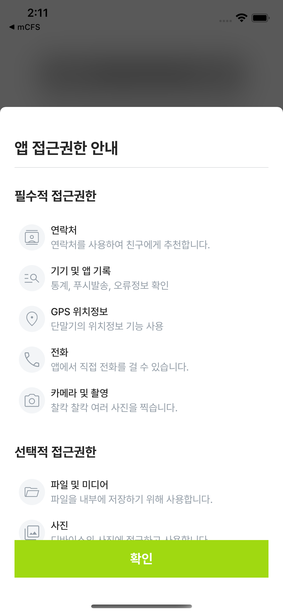
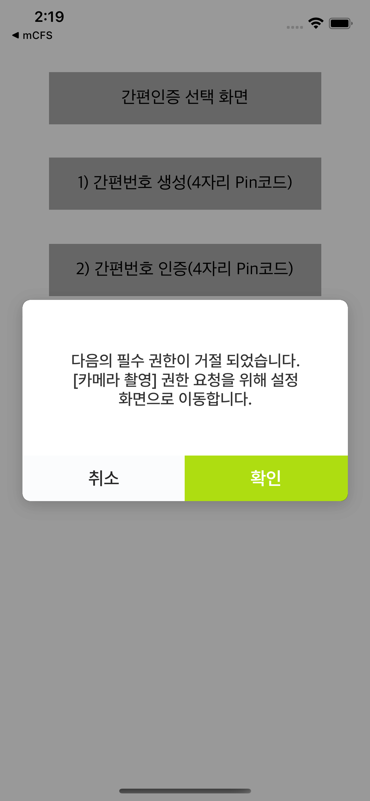
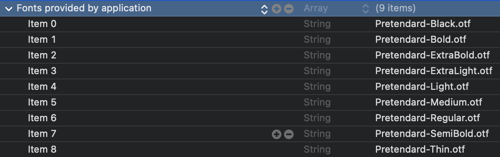
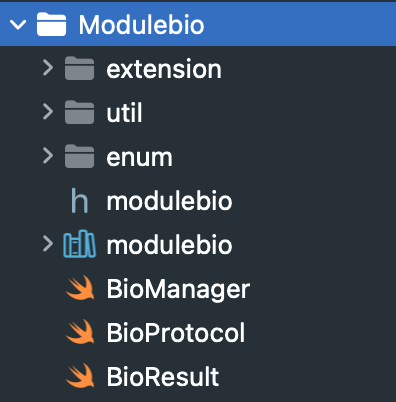
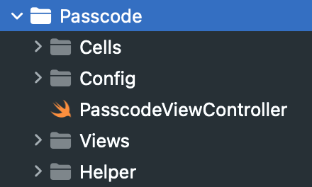
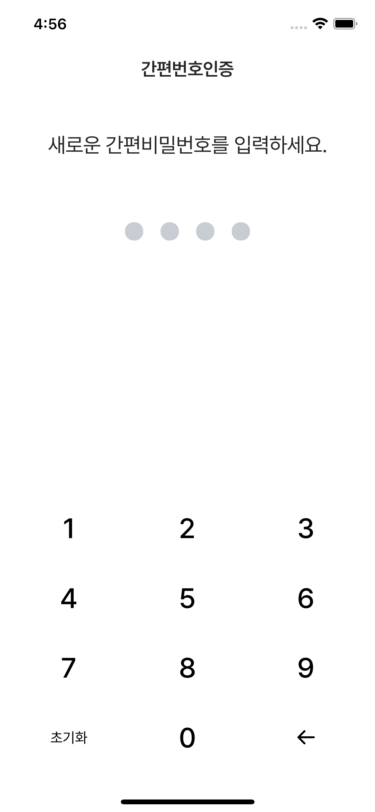
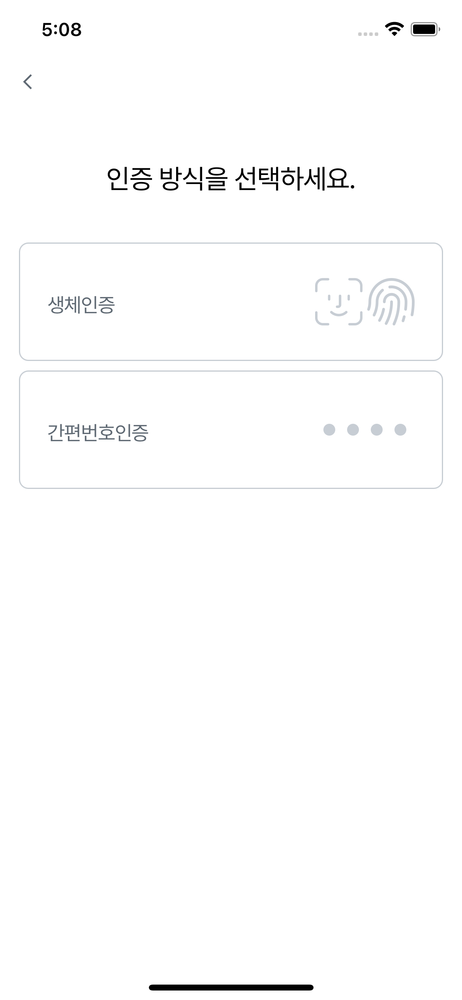
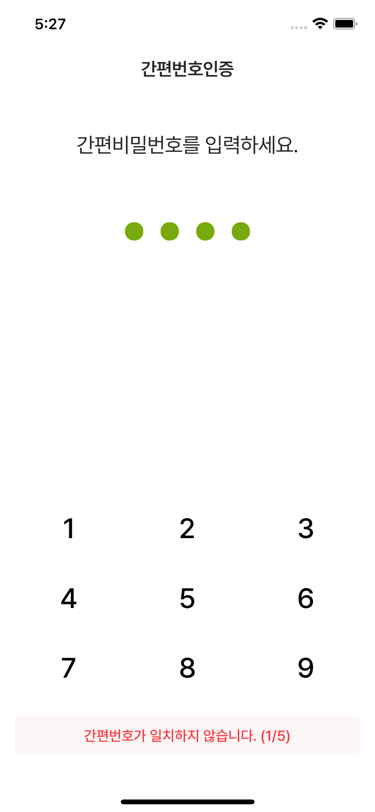
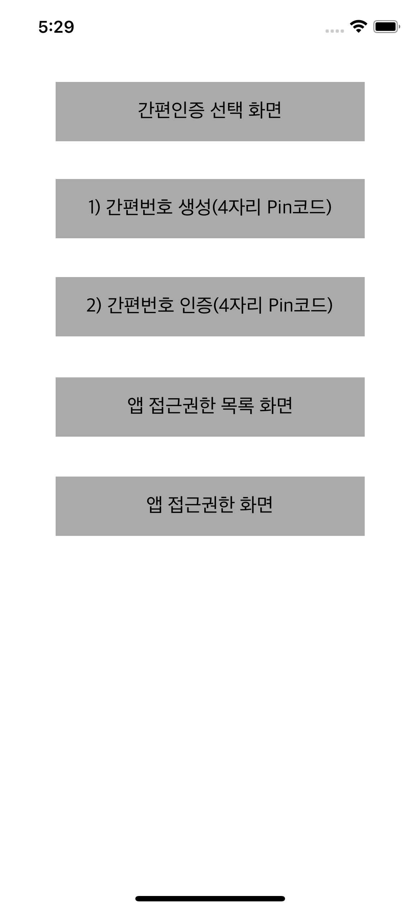

# * 풀무원 간편인증 및  앱 접근권한 샘플 앱  

## iOS 기반의 샘플 앱으로 간편인증(생체인증/4자리 간편번호) 및 앱 접근권한 화면과 기능 사용을 위한 소스코드 및 모듈을 제공합니다.
## <span style="color:red">**PmoViewController를 상속받아 사용하시고, 자세한 내용은 샘플앱을 참조해주시기 바랍니다.**</span>

## 1. 샘플 앱의 그룹별 및 주요 파일 설명

### 1.1. PulmuonePermission 그룹
> ### SwiftUI로 작성된 코드로 다음과 같이 앱 접근권한 안내 화면을 제공하고 권한 요청을 위한 기능을 포함하고 있습니다. 

 



> ### 사용법은 다음과 같으며 샘플앱의 ViewController에서 showPermissionList 함수를 참조해주세요.
```
import SwiftUI //앱 접근권한 화면은 SwiftUI로 작성되어서 추가해야 함.

...

// MARK: - 앱 접근권한 목록 보여주기
private func showPermissionList() {
    var contentView: UIHostingController<PermissionContentView>?
    // 퍼미션 팝업 호출을 Observe 하는 ObservedObject 생성
    @ObservedObject var popupState = PopupState()
    popupState.setShow(showing: true)
    
    // 퍼미션 팝업 설정.
    let permissionContentView = PermissionContentView (popupState: popupState,
                            // 팝업에 노출될 필수 권한 리스트
                            permissionListNecessary: [Permissions.contacts,
                                                      Permissions.history,
                                                      Permissions.location,
                                                      Permissions.callkit,
                                                      Permissions.camera],
                            // 팝업에 노출 될 선택 권한 리스트
                            permissionListOptional: [Permissions.media_library,
                                                    Permissions.photos,
                                                    Permissions.microphone,
                                                    Permissions.calendar],
                            // 접근권한 수동 변경 방법에 표시될 문구
                            permissionSettingDesc: "앱 설정 위치",
                            // 확인 버튼 선택 시 수행할 작업.
                            onConfirmPermission: {
        DispatchQueue.main.asyncAfter(deadline: DispatchTime.now() + 0.5) {
            contentView!.view.removeFromSuperview()
        }
    })
    
    contentView = UIHostingController(rootView: permissionContentView)
    contentView!.view.backgroundColor = UIColor.clear
    contentView!.modalPresentationStyle = .fullScreen
    self.addChild(contentView!)
    self.view.addSubview((contentView?.view)!)
    
    contentView?.view.translatesAutoresizingMaskIntoConstraints = false
    NSLayoutConstraint.activate([
        contentView!.view.widthAnchor.constraint(equalTo: self.view.widthAnchor),
        contentView!.view.heightAnchor.constraint(equalTo: self.view.heightAnchor),
        contentView!.view.centerXAnchor.constraint(equalTo: self.view.centerXAnchor),
        contentView!.view.centerYAnchor.constraint(equalTo: self.view.centerYAnchor)])
}

// MARK: - 앱 접근 권한 요청하기
private func requestNecessaryPermissions() {
    let permissionManager = PermissionManager()

    for permissionItem in permissionNecessary {
        let permissionData = permissionManager.getPermissionAuth(permissionItem: permissionItem)
        
        if (permissionData != .authorized ) {
            
            permissionManager
                .requestPermissions(permission: [permissionItem],
                                    isNacessary: true,
                                    onConfirmPermission: { isSuccess, callbackMessage, isNecessary in
                    if (isSuccess) {
                        self.requestNecessaryPermissions()
                    }
                    else {
                        let nessaryMessage = "다음의 필수 권한이 거절 되었습니다. [" + permissionItem.toString + "] 권한 요청을 위해 설정 화면으로 이동합니다."
                        self.showAlertPopup(popupText: nessaryMessage, okBtnName: self.confirmMessage, cancelBtnName: self.cancelMessage) { Bool in
                            
                            DispatchQueue.main.asyncAfter(deadline: DispatchTime.now() + 0.5) {
                                self.getRootViewController()?.dismiss(animated: false, completion: nil)
                                if (Bool) {
                                    self.toAppSetting() //Device 설정 화면 이동
                                }
                            }
                            
                            self.getTopMostViewController()?.dismiss(animated: false, completion: nil)
                        }
                    }
                })
            return
        }
    }        
}
```

### 1.2. Font 그룹
> ### 무료 폰트인 Pretendard를 기본으로 하며, info.plist에 다음과 같이 추가해주세요.

 
 

### 1.3. Modulebio 그룹
> ### iOS 생체인식 인증 (Face ID / Touch ID)을 쉽게 사용하기 위해 작성되었습니다. 

 

```
// MARK: - 생체인증 기능 제공 및 등록 여부 조회, 등록 요청
private func checkKeyChianSaved(completion: @escaping () -> Void) {
    let retrievedUserId: String? = KeychainWrapper.standard.string(forKey: Constants.LoginInfoKeychain.userIdKey)
    log.verbose("retrievedUserId = \(String(describing: retrievedUserId))")
    
    // 생체인증과 간편번호 인증이 아닐 경우, 또는 저장된 로그인 아이디 (user id)가 없을 경우
    if ((!Defaults[key: Constants.userDefault_BioAuthLoginKey] && !Defaults[key: Constants.userDefault_PinCodeLoginKey]) || retrievedUserId == nil || retrievedUserId == "") {
        DispatchQueue.main.async {
            /**
              간편인증 선택 화면 좌측 상단 백 버튼 보이기 (초기화 화면에서 보이게 처리하면 좋을 듯)
              */
            self.showBioLoginSelectVC(isBackButtonHidden: false) {
                completion()
            }

        }
    } else {
        log.verbose("bioOrNumberLoginBgVC show")
        if (self.getTopMostViewController() != nil) {
            log.verbose("getTopMostViewController(): \(String(describing: self.getTopMostViewController()))")
        }
        
        DispatchQueue.main.async {
            self.bioOrNumberLoginBgVC = BioOrNumberLoginBgVC()
            self.bioOrNumberLoginBgVC!.modalPresentationStyle = .fullScreen
            self.getTopMostViewController()?.present(self.bioOrNumberLoginBgVC!, animated: false) {
                completion()
            }
        }
        
        let result = BioManager.shared.isSupportBiometrics() //생체인증 기능 제공 여부 조회
        
        if (result.success) {
            let register = BioManager.shared.isRegisterBiometrics() //생체인증 등록여부 조회
            if (register) {
                //생체인증 서명 요청
                BioManager.shared.signBiometrics(message: self.plzAuthBioMessage) { result in
                    if(result.success) {
                        self.log.verbose("생체인증 통과")
                        self.retryCount = 0
                        
                        DispatchQueue.main.async {
                            self.showToast(vc: self.getTopMostViewController()!, message: self.authCompleteMessage)
                        }
                        
                    } else {
                        self.log.verbose("생체인증 실패")
                        
                        DispatchQueue.main.async {
                            self.removeKeyChain()
                            self.showToast(vc: self.getTopMostViewController()!, toastMode: .WARNING, message: self.authFailedMessage)
                        }
                    }
                }
            } else {
                //생체인증 등록 요청
                BioManager.shared.registerBiometrics(message: self.plzAuthBioMessage) { result in
                    self.log.verbose("생체인증 등록 요청, result: \(result)")
                }
            }
        } else {
            log.verbose("\(result.errorType) / \(result.errorMsg) / \(result.errorCode)")
            
            var notification = Notification(name: Constants.CustomNotification.bioAuthFailNoti)
            notification.object = result.errorType
            self.bioAuthFailReceived(notification)
        }
        
        DispatchQueue.main.asyncAfter(deadline: DispatchTime.now() + 3.0) {
            self.getRootViewController()?.dismiss(animated: false, completion: nil)
        }
    }
}

...

// MARK: - 생체 인증 성공 이벤트 수신
@objc func bioAuthSuccessReceived(_ notification: Notification) {
    log.verbose("생체 인증 성공 이벤트 수신")
    DispatchQueue.main.asyncAfter(deadline: DispatchTime.now() + 0.1) {
        self.showToast(vc: self.getTopMostViewController()!, message: self.authCompleteMessage)
    }
    self.dismiss(animated: false)
    self.getTopMostViewController()?.dismiss(animated: false, completion: nil)
}

// MARK: - 생체 인증 실페 이벤트 수신
@objc func bioAuthFailReceived(_ notification: Notification) {
    log.error("생체 인증 실패 이벤트 수신")
    
    self.removeKeyChain()
    //self.isBioOrPassCodeLogin = false
    
    var _message = ""
    
    if let result = notification.object as? BioErrorType {
        print("BioErrorType: \(result)")
        print("생체 인증 실패 이벤트 수신: bioLoginSelectVC: \(String(describing: bioLoginSelectVC))")
        
        switch result {
        case BioErrorType.cancel:  //사용자가 인증을 취소 하였습니다.
            break
        case BioErrorType.deviceLockout: //생체인증 시도한 실패 횟수가 너무 많아 생체인증을 사용할수 없습니다.
            _message = self.deviceLockOutMessage
            break
        case BioErrorType.deviceNotEnrolled: //기기에 등록된 생체 인증 정보가 없습니다. 기기에 생체인증 등록후 이용 가능합니다.
            _message = deviceNotEnrolledMessage
            
            DispatchQueue.main.asyncAfter(deadline: DispatchTime.now() + 0.1) {
                self.showToast(vc: self.getTopMostViewController()!, message: self.authFailedMessage)
            }
            
            self.showAlertPopup(popupText: _message, okBtnName: self.confirmMessage, cancelBtnName: self.cancelMessage) { Bool in
                // 생체인증 및 간편번호 설정값 초기화
                Defaults[key: Constants.userDefault_BioAuthLoginKey] = false
                Defaults[key: Constants.userDefault_PinCodeLoginKey] = false
                
                DispatchQueue.main.asyncAfter(deadline: DispatchTime.now() + 0.5) {
                    self.getRootViewController()?.dismiss(animated: false, completion: nil)
                    if (Bool) {
                        BioManager.shared.moveSetting() //Device 설정 화면 이동
                    }
                }
                Defaults[key: Constants.userDefault_IsLoginKey] = false                
                self.getTopMostViewController()?.dismiss(animated: false, completion: nil)
            }
            
            return
        case BioErrorType.deviceNotAvailable: //기기에서 생체 인식을 사용할 수 없습니다.
            _message = self.deviceNotAvailableMessage
            break
        case BioErrorType.deviceNotSupported: //생체인증을 지원하지 않는 기기입니다.
            _message = self.deviceNotSupportedMessage
            break
        case BioErrorType.appBioNotRegister: //앱에 등록된 생체인증 정보가 없습니다. 앱에 생체인증 등록후 이용해 주세요.
            _message = self.appBioNotRegisterMessage
            break
        case BioErrorType.existBiometrics: //이미 등록된 생체인증 정보가 존재 합니다.
            _message = self.existBiometricsMessage
            break
        case BioErrorType.optionOff: //앱내 생체인증 사용 여부 Off 상태임
            break
        case BioErrorType.error: //공통 에러(NSError에 상세 코드 확인)
            _message = self.authFailedMessage
            break
        default:
            break
        }
        
        DispatchQueue.main.asyncAfter(deadline: DispatchTime.now() + 1.0) {
            if (!_message.isEmpty && _message.count > 0) {
                self.showAlertPopup(popupText: _message, okBtnName: self.confirmMessage) { Bool in
                    self.getRootViewController()?.dismiss(animated: false, completion: nil)
                }
            } else {
                self.getRootViewController()?.dismiss(animated: false, completion: nil)
            }
        }
    }
}
```

### 1.4. Passcode 그룹
> ### 4자리 간편번호 설정 화면 제공 및 로직이 구현되어 있습니다. 간편번호 인증은 최대 5번까지 시도합니다.

 
 
 

```
// MARK: - 간편번호 입력 화면 보임
private func showPassCodeVC(mode: PasscodeViewController.Mode) {
    var passCodeFailCount = 0
    
    DispatchQueue.main.async {
        if let vc = PasscodeViewController.instance(with: mode) {
            vc.modalPresentationStyle = .fullScreen
            self.getTopMostViewController()?.present(vc, animated: false)
            vc.show { passcode, newPasscode, mode in
                self.log.verbose("passcode: \(passcode), newPasscode: \(newPasscode), mode: \(mode)")
                
                // 간편번호 생성
                if (mode == .CREATE) {
                    self.log.verbose("PassCode Creeate")
                    //키체인에 4자리 간편번호 저장
                    KeychainWrapper.standard.set(passcode, forKey: Constants.LoginInfoKeychain.passCodeKey)
                    
                    // 생체인증 or 간편번호 선택 여부 저장, 앱 실행시 체크해서 생체인증 or 간편번호 화면을 보임
                    Defaults[key: Constants.userDefault_BioAuthLoginKey] = false
                    Defaults[key: Constants.userDefault_PinCodeLoginKey] = true
                    
                    self.showToast(vc: self.getTopMostViewController()!, message: self.pinNumberSetMessage)
                    
                    // 토스트 메시지 보여주고 바로 간편번호 화면을 닫지 말고 2초후에 닫히도록 함.
                    DispatchQueue.main.asyncAfter(deadline: DispatchTime.now() + 2.0) {
                        vc.dismiss(animated: false)
                        self.getRootViewController()?.dismiss(animated: false, completion: nil)
                    }
                    
                }
                // 간편번호 생성 후 검증
                else if (mode == .VERIFY) {
                    self.log.verbose("PassCode Verify")
                    let savedPassCode: String? = KeychainWrapper.standard.string(forKey: Constants.LoginInfoKeychain.passCodeKey) ?? ""
                    //키체인에 저장된 4자리 간편번호와 현재 입력한 간편번호와 비교
                    if (passcode == savedPassCode) {
                        self.log.verbose("PassCode Verify Pass!!!")
                        //self.isBioOrPassCodeLogin = true
                        passCodeFailCount = 0
                        
                        /**
                          TODO: 간편번호가 매칭되어 성공이 될 경우 할 일...
                          */
                        DispatchQueue.main.async {
                            self.showToast(vc: self.getTopMostViewController()!, message: self.authCompleteMessage)
                        }
                    } else {
                        passCodeFailCount += 1
                        
                        self.log.verbose("PassCode Verify passCodeFailCount: \(passCodeFailCount)!!!")
                        let passCodeFailCountMsg = String(format: self.failedPINNumberCountMessage, passCodeFailCount, Constants.passCodeFailMaxCount)
                        //AppSnackBar.make(in: (self.getTopMostViewController()?.view)!, message: passCodeFailCountMsg, duration: .lengthShort).show()
                        self.showToast(vc: self.getTopMostViewController()!, toastMode: .WARNING, message: passCodeFailCountMsg)
                        
                        if(passCodeFailCount >= Constants.passCodeFailMaxCount) {
                            self.log.verbose("PassCode Verify FailCount Over!!!")
                            Defaults[key: Constants.userDefault_PinCodeLoginKey] = false
                            
                            /**
                              TODO: 간편번호가 매칭안되어 실패할 경우 할 일...
                              */
                            passCodeFailCount = 0
                        }
                    }
                }
                vc.startProgressing()
                DispatchQueue.main.asyncAfter(deadline: DispatchTime.now() + 2.0) {
                    vc.stopProgress()
                    if (mode == .VERIFY && passCodeFailCount <= 0) {
                        vc.dismiss(animated: false, completion: nil)
                    }
                }
            } notMatchCallback: { notMatchCount in // 일치하지 않는 횟수 콜백, 최대 5번 시도
                self.log.error("notMatchCount: \(notMatchCount)")
                
                if (notMatchCount >= Constants.passCodeFailMaxCount) {
                    self.removeKeyChain()
                    
                    DispatchQueue.main.asyncAfter(deadline: DispatchTime.now() + 1.0) {
                        vc.dismiss(animated: false)
                        self.getRootViewController()?.dismiss(animated: false, completion: nil)
                    }
                }
                
                self.showToast(vc: self.getTopMostViewController()!, toastMode: .WARNING, message: String(format: self.failedPINNumberCountMessage, (notMatchCount), Constants.passCodeFailMaxCount))
            }
        }
    }
}
```

### 1.5. AuthMethod 그룹
> ### 인증 방식 선택 화면과 로직이 구현되어 있으며 생체인증시 백그라운드 이미지를 제공합니다.

 
 
 

```
// MARK: - 간편인증 초기화 될 경우, 생체인증/간편번호 선택 화면 보임
private func showBioLoginSelectVC(isBackButtonHidden: Bool = true, completion: @escaping () -> Void) {
    log.verbose("isBackButtonHidden: \(isBackButtonHidden)")
    DispatchQueue.main.async {
        if (self.bioLoginSelectVC == nil) {
            self.bioLoginSelectVC = BioLoginSelectVC()
        }
        self.bioLoginSelectVC?.delegate = self
        self.bioLoginSelectVC?.isBackButtonHidden = isBackButtonHidden
        
        self.bioLoginSelectVC?.modalPresentationStyle = .fullScreen
        self.present(self.bioLoginSelectVC!, animated: false) {
            completion()
        }
    }
}
```

### 1.6. Popup 그룹
> ### 팝업 화면과 로직이 구현되어 있습니다. PmoViewController에 호출 함수가 구현되어 있습니다. 

 


```
// MARK: 취소, 확인 버튼이 있는 팝업
public func showAlertPopup(popupText: String , okBtnName: String, cancelBtnName: String, completionHandler: @escaping (Bool) -> Void){
    print("showBasicPopup1")
    let popvc = PopupVC(popupType: .cancelAndOK, popupText: popupText, cancelBtnName: cancelBtnName, okBtnName: okBtnName, completionHandler: completionHandler)
    popvc.modalPresentationStyle = UIModalPresentationStyle.overCurrentContext
    DispatchQueue.main.async {
        self.getTopMostViewController()?.present(popvc, animated: false, completion: nil)
    }
}

// MARK: 확인 버튼만 있는 팝업
public func showAlertPopup(popupText: String, okBtnName: String, completionHandler: @escaping (Bool) -> Void){
    print("showBasicPopup2")
    let popvc = PopupVC(popupType: .onlyOK, popupText: popupText, okOneBtnName: okBtnName, completionHandler: completionHandler)
    popvc.modalPresentationStyle = UIModalPresentationStyle.overCurrentContext
    DispatchQueue.main.async {
        self.getTopMostViewController()?.present(popvc, animated: false, completion: nil)
    }
}
```

---

## 2. 기타
### 2.1. PmoViewController에 Toast가 구현되어 있습니다.

 
 

```
static let DELAY_SHORT = 2.0//1.5
static let DELAY_LONG = 3.0

func showToast(vc: UIViewController, toastMode: ToastMode = .NORMAL, message: String, font: UIFont = UIFont(name: "Pretendard-Medium", size: 15)!, delay: TimeInterval = DELAY_SHORT) {
    log.verbose("showToast: vc: \(vc)")
    let toastLabel = UILabel(frame: CGRect(x: self.view.frame.size.width - (self.view.frame.size.width - 32/2), y: self.view.frame.size.height - 100, width: self.view.frame.size.width - 32, height: 41))
    toastLabel.backgroundColor = toastMode == .NORMAL ? UIColor(rgb: 0x2D3741).withAlphaComponent(0.6) : UIColor(rgb: 0xFDF6F6)
    toastLabel.textColor = toastMode == .NORMAL ? UIColor.white : UIColor(rgb: 0xFF333D)
    toastLabel.font = font
    toastLabel.textAlignment = .center;
    toastLabel.text = message
    toastLabel.alpha = 1.0
    toastLabel.layer.cornerRadius = 4;
    toastLabel.clipsToBounds = true
    vc.view.addSubview(toastLabel)
    toastLabel.bringSubviewToFront(vc.view)

    UIView.animate(withDuration: 0.5, delay: 0, options: .curveEaseIn, animations: {
        toastLabel.alpha = 1
    }, completion: { _ in
        UIView.animate(withDuration: 0.5, delay: delay, options: .curveEaseOut, animations: {
            toastLabel.alpha = 0
        }, completion: {_ in
            toastLabel.removeFromSuperview()
        })
    })
}
```
### 2.2. Podfile

```
# Uncomment the next line to define a global platform for your project
# platform :ios, '9.0'

target 'PulmuoneSimpleAuthSample' do
  # Comment the next line if you don't want to use dynamic frameworks
  use_frameworks!

  # Pods for PulmuoneSimpleAuthSample
  # Keychain Services API를 보다 편하고 안전하게 이용할 수 있게끔 해주는 라이브러리, 간편인증 로그인을 위해 아이디, 비밀번호를 앱에 안전하게 저장하기 위해 사용
  pod 'SwiftKeychainWrapper'
  # 편리한 로그 확인을 위해 사용
  pod 'SwiftyBeaver'
  # NSUserDefaults 업그레이드 버전 라이브러리
  pod 'SwiftyUserDefaults'

  target 'PulmuoneSimpleAuthSampleTests' do
    inherit! :search_paths
    # Pods for testing
  end

  target 'PulmuoneSimpleAuthSampleUITests' do
    # Pods for testing
  end

end
```
---

## 3. 샘플 앱 메인화면
> ### 다음과 같이 샘플 앱은 구현되어 있습니다. 

 
 
 
 
 


